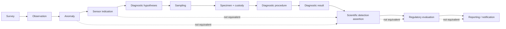

# Black Mesa ontology

Black Mesa is a sensor-agnostic agricultural biosecurity ontology and validation suite for representing the evidentiary path from observation through diagnostic determination and regulated-action evaluation without collapsing those stages into a single detection flag.

The ontology is currently version **0.4.0**. The executable semantic contract lives in `schema/`, `upper/`, and the validation suite; the documentation explains that contract but does not override it.

> **Safety boundary:** a sensor indication is not a diagnosis. Current jurisdictional rule records are draft, non-operative decision-support records. Phase 1 external regulatory notification remains human-reviewed.

## The evidence chain



Black Mesa models transformations of evidence, not synonyms. An anomaly means something warrants investigation; it does not identify a pathogen. A diagnostic result is not automatically a field-wide biological conclusion. A scientific detection is not itself a regulatory action.

## Start here

- **New project member:** [documentation portal](docs/README.md) → [mission and scope](docs/overview/mission-and-scope.md) → [system architecture](docs/overview/system-architecture.md).
- **Ontology engineer:** [modeling principles](docs/model/modeling-principles.md) → [generated reference](docs/reference/README.md) → [extension workflows](docs/operations/extension-workflows.md).
- **ML / sensing:** [sensing and anomalies](docs/model/sensing-and-anomalies.md) → [assertions, dispositions, and confidence](docs/model/assertions-dispositions-confidence.md) → [graph boundaries](docs/operations/graph-boundaries.md).
- **Field / laboratory operations:** [specimens and custody](docs/model/specimens-and-custody.md) → [diagnostics](docs/model/diagnostics.md) → [canonical workflow](docs/examples/canonical-workflow.md).
- **Regulatory review:** [regulatory boundary](docs/model/regulatory-boundary.md) → [rule governance](docs/governance/regulatory-rules.md).
- **Contributor:** [CONTRIBUTING.md](CONTRIBUTING.md) → [validation and CI](docs/operations/validation-and-ci.md).

## Repository anatomy

```text
schema/      OWL/RDF domain schema, reporting crosswalks, and SHACL
upper/       shared BFO-aligned upper module
reference/   deployment/reference instances such as pilot pathosystems
rules/       jurisdiction-specific ReportingRule records
examples/    executable RDF examples
tests/       semantic invariants and adversarial fixtures
tools/       validation and documentation generation
docs/        explanatory, governance, operational, and generated documentation
vendor/      pinned third-party ontology assets used for offline validation
```

Large imagery and dense sensor arrays stay outside RDF. The graph records their URI, checksum, provenance, spatial support, interpretation, and relationships.

## Validate

```bash
python -m pip install -r requirements.txt
python tools/validate_ontology.py schema/bmo-core.ttl schema/reporting-crosswalks.ttl --shapes schema/shapes.ttl
python -m pytest tests/ -q
python tools/schema_docs.py --schema schema --out docs/reference
python tools/validate_docs.py
```

See [validation and CI](docs/operations/validation-and-ci.md).

## Persistent identifiers

- ontology IRI: `https://w3id.org/black-mesa/bmo`
- term namespace: `https://w3id.org/black-mesa/bmo/`
- version IRI: `https://w3id.org/black-mesa/bmo/releases/0.4.0`
- upper ontology IRI: `https://w3id.org/black-mesa/upper`

Public W3ID resolution is a deployment dependency and must be verified independently of local RDF declarations. See [persistent identifiers](docs/governance/persistent-identifiers.md).

## Licensing

Project-authored ontology/semantic content, SHACL, reference RDF, worked RDF examples, diagrams, and documentation are CC BY 4.0 unless otherwise stated. Executable software/tooling under `src/`, `tools/`, `tests/`, and `.github/` is Apache-2.0. Third-party artifacts retain their own terms.

See [LICENSE](LICENSE), [LICENSE-ONTOLOGY.md](LICENSE-ONTOLOGY.md), [LICENSE-SOFTWARE.md](LICENSE-SOFTWARE.md), [NOTICE.md](NOTICE.md), and [licensing guidance](docs/governance/licensing.md).

## Publishing warning

This public repository has historically been assembled from a separate source/publishing workspace. Accepted changes must be carried back to that source of truth before a later automated publish can overwrite them.
