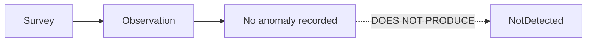

# Worked example: negative survey

Executable source: [`examples/negative-survey.ttl`](../../examples/negative-survey.ttl).

```text
Survey occurred.
No anomaly was recorded.
No specimen was collected.
No diagnostic procedure occurred.
Therefore no NotDetected diagnostic disposition exists.
```



The correct interpretation is **surveyed; no anomaly recorded**.

A different chain is required for a diagnostic disposition:

```text
specimen collected → diagnostic procedure performed → diagnostic result
→ diagnostic interpretation → NotDetected
```

Even then, `NotDetected` means the target was not detected by the diagnostic work performed within that evidence's scope and method limits. It does not prove absence across the entire field, farm, or region.
