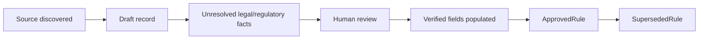

# Worked example: regulatory-rule lifecycle

Regulatory records begin as source-backed intake records and become operational only through designated human review.



## Draft pattern

```turtle
rule:EXAMPLE-DRAFT a bmo:ReportingRule ;
    bmo:ruleIdentifier "EXAMPLE-DRAFT" ;
    bmo:appliesInJurisdiction bmo:Arkansas ;
    bmo:regulatoryAuthority ex:Authority ;
    dct:source <https://example.invalid/official-source-placeholder> ;
    bmo:ruleReviewStatus bmo:DraftRequiresLegalRegulatoryReview ;
    bmo:requiresHumanReview true ;
    bmo:legalReviewNote "Verify trigger, scope, recipient, timing, and restrictions." .
```

The URL is intentionally fictional; do not add fictional approved rules to the operational registry.

## Invalid draft

```turtle
rule:UnsafeDraft a bmo:ReportingRule ;
    bmo:ruleReviewStatus bmo:DraftRequiresLegalRegulatoryReview ;
    bmo:requiresHumanReview false .
```

SHACL rejects this because a draft cannot disable the human-review gate.

An approved record should contain verified facts required by project review and an effective-from date. The machine constraint is a minimum, not a claim that SHACL performs legal review.

When a newer rule supersedes an older version, retain the old record and link versions with `supersedesRule`.
