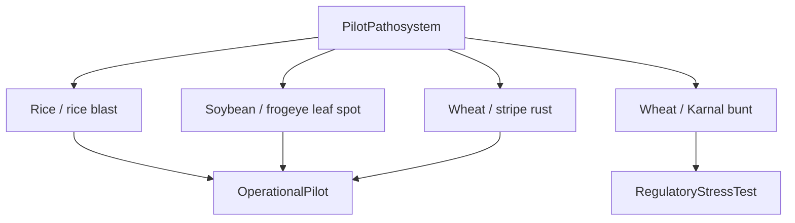

# Pilot pathosystems

Pilot pathosystems are reference data, not biological subclasses in the core ontology.

The current source is `reference/pilot-pathosystems.ttl`.

| Profile | Host | Pathogen | Role |
|---|---|---|---|
| `RICE-BLAST` | *Oryza sativa* — NCBITaxon:4530 | *Pyricularia oryzae* — NCBITaxon:318829 | `OperationalPilot` |
| `SOY-FROGEYE` | *Glycine max* — NCBITaxon:3847 | *Cercospora sojina* — NCBITaxon:438356 | `OperationalPilot` |
| `WHEAT-STRIPE-RUST` | *Triticum aestivum* — NCBITaxon:4565 | *Puccinia striiformis* f. sp. *tritici* — NCBITaxon:168172 | `OperationalPilot` |
| `WHEAT-KARNAL-BUNT-REGULATORY` | *Triticum aestivum* — NCBITaxon:4565 | *Tilletia indica* — NCBITaxon:43049 | `RegulatoryStressTest` |

SHACL requires exactly one canonical host taxon, one canonical pathogen taxon, and one scenario role per profile.

The Karnal bunt profile exercises the evidence-to-regulation boundary. It does not assert that Karnal bunt is the first sensing model Black Mesa should build.

Taxonomic synonymy remains primarily the responsibility of the external authority. If an identifier becomes obsolete or incorrect, fix the reference data through a reviewed semantic change rather than inventing a new local taxonomy.
