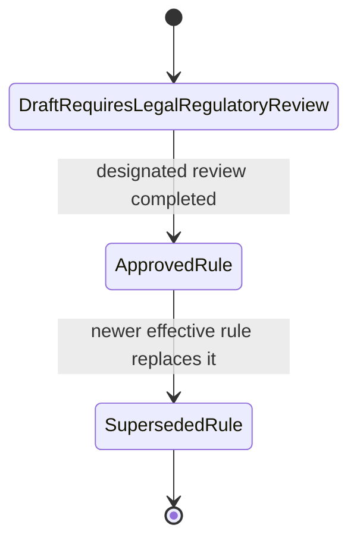

# Regulatory-rule governance

`rules/` is the versioned boundary between scientific detections and jurisdiction-dependent action.

Current intake directories:

```text
rules/US-AR/
rules/US-LA/
rules/US-MO/
rules/US-OK/
rules/US-TX/
```

All five current records are `DraftRequiresLegalRegulatoryReview`.



## What current drafts actually contain

Each current draft records a stable rule identifier, jurisdiction, state agriculture authority, at least one official source URL, draft review status, `requiresHumanReview true`, and a legal-review note.

They deliberately do **not** encode unverified state-specific triggers, deadlines, enforcement consequences, recipients, confirmation methods, regulated commodities/areas, or movement restrictions.

## Schema capacity versus populated fact

The schema can represent `ruleIdentifier`, `regulatoryAuthority`, effective dates, regulated taxon/host/commodity/area, trigger stage/disposition, confirmation method, human review, required action, recipient, deadline, movement restriction, supersession, review status, and legal-review note.

A property's existence in the schema is not evidence that a current state file has a verified value for it.

## Draft contract and approval

Every rule must identify its ID, jurisdiction, authority, source, review status, and human-review setting. A draft must require human review and carry a note explaining unresolved verification.

Draft rules are non-operative decision-support records. They cannot authorize autonomous notification, quarantine, destruction, movement restriction, or another external action.

Promotion to `ApprovedRule` means the project's designated review has been completed; it is not governmental endorsement. SHACL currently requires an approved rule to record an effective-from date, but the human review checklist is broader than that minimum constraint.

Historical versions should be retained and connected with `supersedesRule`.
