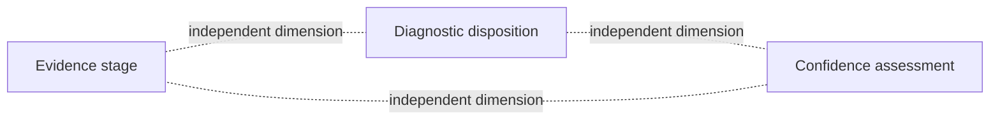

# Assertions, dispositions, and confidence

Black Mesa separates three dimensions often collapsed into one “confidence” field.



## Evidence stage

Where the evidence comes from:

```text
SensorIndicationStage
FieldObservationStage
SpecimenEvidenceStage
DiagnosticEvidenceStage
ConfirmatoryEvidenceStage
```

## Diagnostic disposition

What diagnostic work concludes:

```text
Confirmed
Suspected
NotDetected
Undetermined
```

## Confidence assessment

How much weight an assertion can bear:

```text
evidence strength
evidence completeness
model applicability
assay applicability
provenance quality
optional calibrated probability
```

A calibrated probability must be in [0,1] and is meaningful only if a calibrated model actually generated it.

## Sensor-stage example

```text
Evidence stage:          SensorIndicationStage
Diagnostic disposition: none
Evidence strength:       ModerateEvidence
Evidence completeness:   PartialEvidence
Model applicability:     ValidatedApplicability
Calibrated probability:  0.72
```

## Confirmatory example

```text
Evidence stage:          ConfirmatoryEvidenceStage
Diagnostic disposition: Confirmed
Evidence strength:       VeryStrongEvidence
Evidence completeness:   CompleteEvidence
Assay applicability:     ValidatedApplicability
Provenance quality:      CompleteProvenance
```

The later assertion does not erase the earlier sensor record. Both remain part of the investigation history.

`ConfidenceTier` and `PreSymptomatic` are deprecated compatibility concepts.
