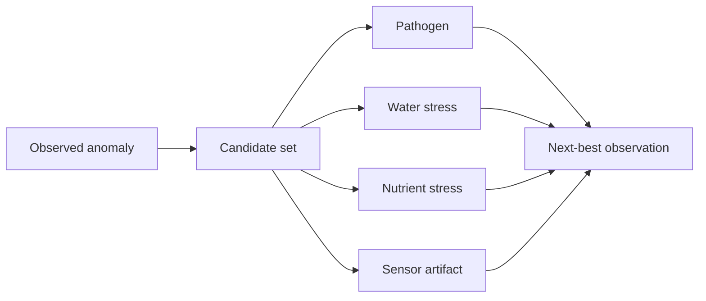

# Hypotheses and next-best action

Black Mesa retains competing causal explanations instead of prematurely converting an anomaly into a diagnosis.



`DiagnosticHypothesis` represents one candidate. `DiagnosticCandidateSet` groups the live candidates. A hypothesis can carry an ordinal `candidateRank`; it may carry `candidateProbability` only when a calibrated model produced a real probability.

`ObservationRequirement` and `SamplingRecommendation` represent requested next evidence. The model includes optional `expectedInformationGain` and `expectedCost` fields so a decision service can record why one action was selected over another.

The ontology does not calculate information gain, perform active learning, or optimize a sampling route. It records the requirement/recommendation and relevant evidence so those decisions can be audited.

A useful pattern is:

```text
anomaly → candidate set → discriminating observation requirement
→ sampling recommendation → specimen collection
```

Do not encode “the top-ranked hypothesis” as a confirmed detection without diagnostic evidence.
