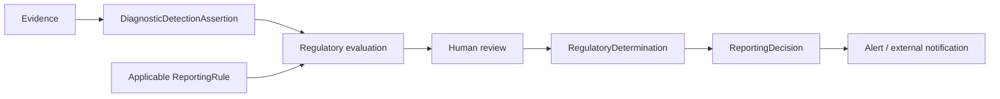

# Regulatory boundary

Scientific evidence and regulated external action are separate layers.

A scientific record should remain interpretable even when a reporting threshold, quarantine rule, authority, or effective date changes. Black Mesa therefore represents jurisdictions and reporting rules as data rather than disease/detection subclasses.

Current operational jurisdictions are Arkansas, Louisiana, Missouri, Oklahoma, and Texas.

## Draft rules

The current state rule records are `DraftRequiresLegalRegulatoryReview`. They are intake scaffolds, not machine-executable law. Each draft must require human review and carry a legal-review note.

Do not infer missing triggers, deadlines, recipients, confirmation methods, regulated commodities, regulated areas, or movement restrictions.

## Human gate

Phase 1 external regulatory notification remains human-reviewed. The ontology can support rule evaluation and record its provenance, but it does not authorize autonomous notification merely because a detection exists.

An `ApprovedRule` is a Black Mesa project governance status indicating designated review has been completed. It must not be described as governmental endorsement unless separate evidence establishes that fact.
