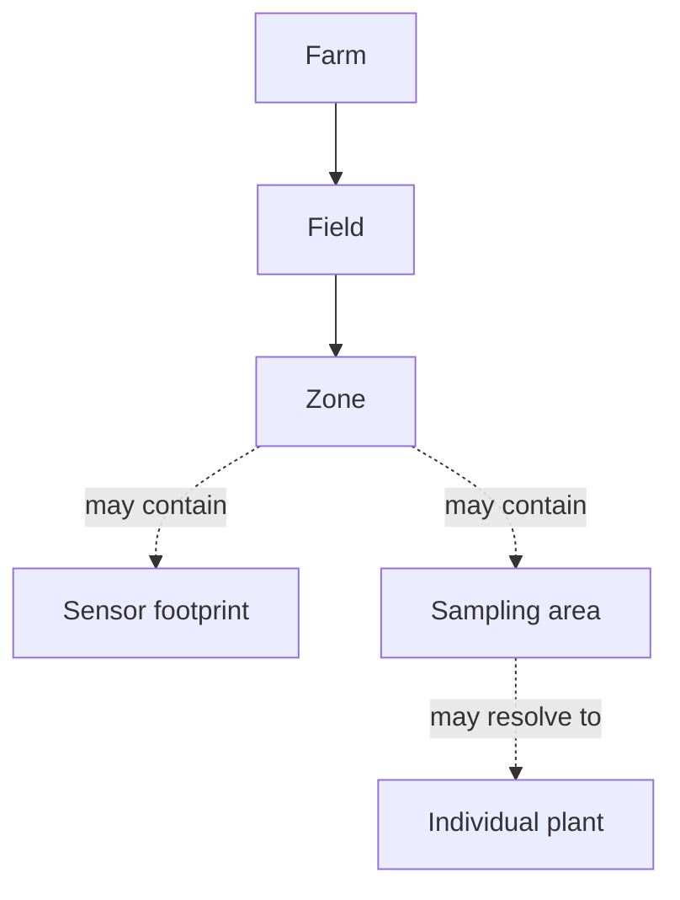

# Spatial support

Black Mesa separates geographic containment from evidentiary warrant.

`Farm`, `Field`, and `Zone` describe managed places. `SpatialSupportDescription` describes the footprint over which an observation or assertion is warranted.

Current support kinds include point, individual plant, crop row, polygon, management zone, field, raster footprint, sensor footprint, and sampling area.

The distinction matters because evidence does not automatically generalize. A specimen may represent one plant; a diagnostic result from it does not by itself establish the status of every plant in the field.

Use `partOfSite` for site containment and `hasSpatialSupport` where an information object's evidentiary footprint needs to be explicit.

The ontology can represent spatial warrant, but it does not by itself prove that a sampling design is statistically representative.
