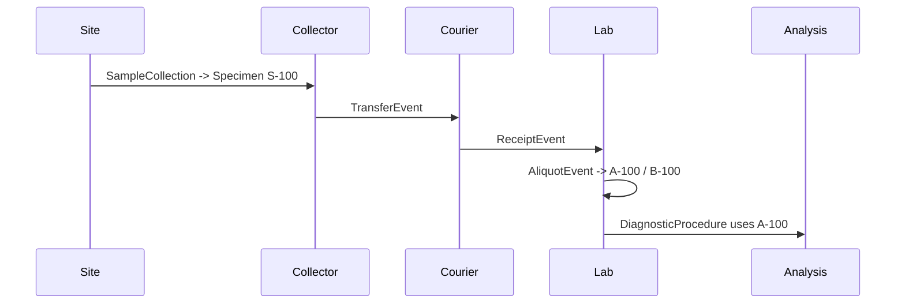

# Specimens and custody

Physical evidence must remain identifiable across collection, transfer, receipt, storage, subdivision, and analysis.

## Core entities

- `SampleCollection`: the sampling process and first custody event.
- `Specimen`: collected material with persistent identity.
- `Aliquot`: separated material with its own identity and genealogy.
- `CustodyEvent`: general custody process record.
- `TransferEvent`, `ReceiptEvent`, `StorageEvent`, `AliquotEvent`: specialized custody events.
- `CustodyChain`: the real sequence of custody processes.
- `CustodyRecord`: information documenting those processes.

## Event information

Depending on event type, the model can record custody subject, event time, responsible agent, releasing/receiving custodian, immediately previous custody event, container identifier, seal identifier, and tamper/integrity status.

A transfer must identify exactly one custody subject, releasing custodian, receiving custodian, and event time; it must identify the responsible event agent. A receipt similarly identifies the subject, receiving custodian, responsible agent, and time.

## Specimen versus aliquot

If specimen S-100 is divided for qPCR and sequencing, the portions are not vague references to “the sample.” Each aliquot receives identity and lineage to the source specimen. Results can therefore be tied to the material actually analyzed.

## What validation proves

SHACL enforces important minimum data contracts. It does not prove legal admissibility, complete chain continuity under every jurisdiction, proper field procedure, or absence of fraud. The model is designed to support traceability and audit; legal defensibility depends on implementation and external requirements as well.
