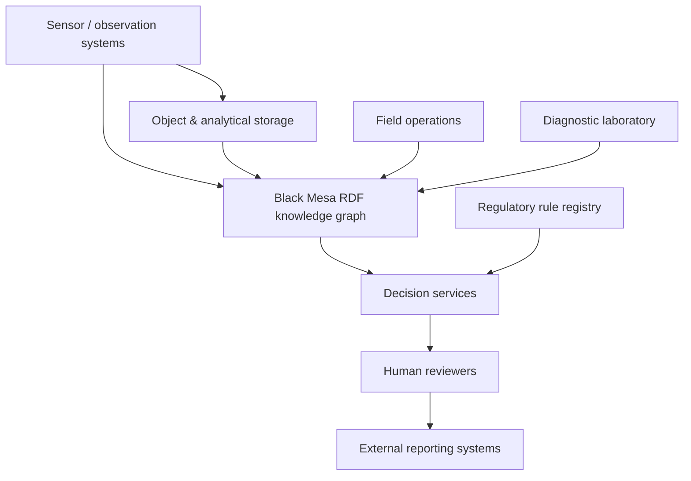
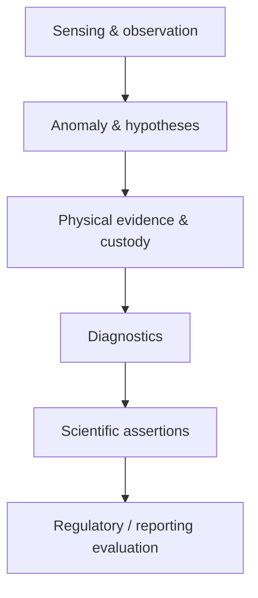
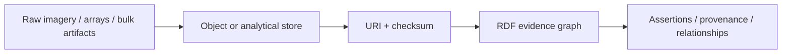

# System architecture

Black Mesa separates semantic state from raw analytical storage and from policy execution.

## System context

The boxes are architectural responsibilities, not a requirement that each become a separate software service.

## Semantic layers

## Storage boundary

RDF stores identity, relationships, provenance, assertions, rules, spatial support, and verifiable pointers. It is not intended to carry millions of pixel/band/tile triples.

The runtime semantic contract is distributed across `schema/bmo-core.ttl`, `schema/reporting-crosswalks.ttl`, `schema/shapes.ttl`, `upper/upper-core.ttl`, and `tests/`.
