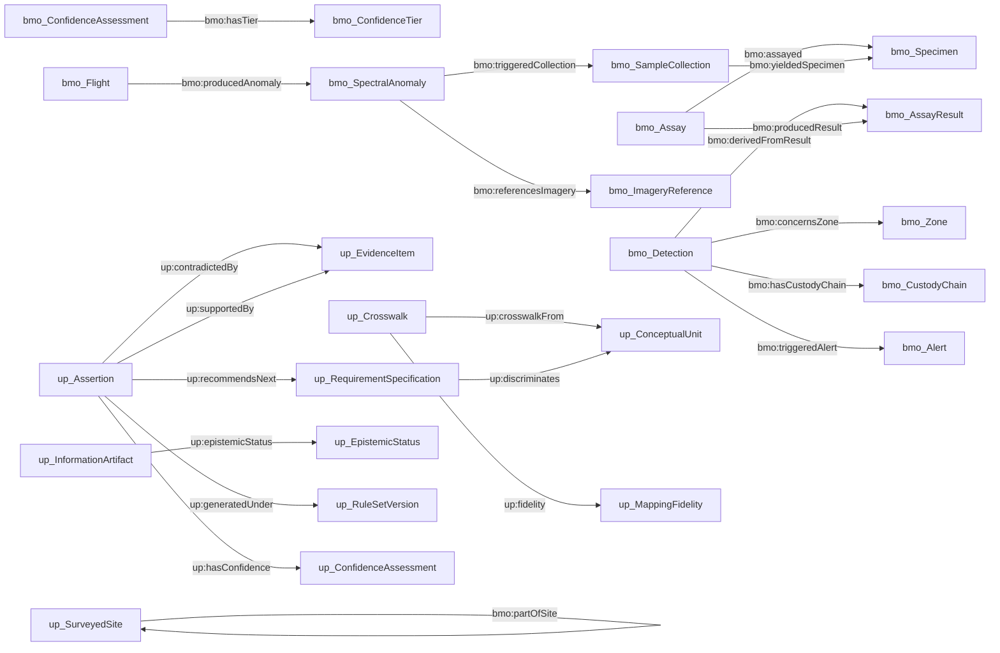

<!-- GENERATED FILE - do not hand-edit. -->
<!-- Rebuild with tools/schema_docs.py; see docs/maintainers/generated-artifacts.md. -->

# Class diagrams

Mermaid source, rendered natively by GitHub. Regenerated from the Turtle, so it cannot drift from the schema the way a checked-in image can.

## Anchoring

Every domain class by the kind of thing it is. This is the whole content of the upper-ontology commitment: adding a class means answering this question, and a SHACL constraint refuses one that does not.

```mermaid
graph TD
  K0["disposition"]
  K0 --> K0_0["up:Capability"]
  K1["information"]
  K1 --> K1_0["bmo:Alert"]
  K1 --> K1_1["bmo:AssayResult"]
  K1 --> K1_2["bmo:ConfidenceAssessment"]
  K1 --> K1_3["bmo:ConfidenceTier"]
  K1 --> K1_4["bmo:Detection"]
  K1 --> K1_5["bmo:DetectionLimit"]
  K1 --> K1_6["bmo:ImageryReference"]
  K1 --> K1_7["bmo:ObservationRequirement"]
  K1 --> K1_8["bmo:ReportingCrosswalk"]
  K1 --> K1_9["bmo:SpectralAnomaly"]
  K1 --> K1_10["up:Assertion"]
  K1 --> K1_11["up:CandidateSet"]
  K1 --> K1_12["up:ConceptualUnit"]
  K1 --> K1_13["up:ConfidenceAssessment"]
  K1 --> K1_14["up:Crosswalk"]
  K1 --> K1_15["up:DerivedDatum"]
  K1 --> K1_16["up:EpistemicStatus"]
  K1 --> K1_17["up:EvidenceItem"]
  K1 --> K1_18["up:ExternalAssignment"]
  K1 --> K1_19["up:InformationArtifact"]
  K1 --> K1_20["up:MappingFidelity"]
  K1 --> K1_21["up:RequirementSpecification"]
  K1 --> K1_22["up:RuleSetVersion"]
  K1 --> K1_23["up:SupportDescription"]
  K1 --> K1_24["up:ThresholdSpecification"]
  K2["matter"]
  K2 --> K2_0["bmo:Specimen"]
  K2 --> K2_1["up:Specimen"]
  K3["matter (object aggregate)"]
  K3 --> K3_0["bmo:Host"]
  K3 --> K3_1["up:OccurrentAggregate"]
  K4["matter (object)"]
  K4 --> K4_0["bmo:Container"]
  K5["place (site)"]
  K5 --> K5_0["bmo:Farm"]
  K5 --> K5_1["bmo:Field"]
  K5 --> K5_2["bmo:Zone"]
  K5 --> K5_3["up:SurveyedSite"]
  K6["process"]
  K6 --> K6_0["bmo:Assay"]
  K6 --> K6_1["bmo:CustodyChain"]
  K6 --> K6_2["bmo:Flight"]
  K6 --> K6_3["bmo:SampleCollection"]
  K6 --> K6_4["up:AnalysisProcess"]
  K6 --> K6_5["up:DisturbanceEvent"]
  K6 --> K6_6["up:ObservationProcess"]
  K6 --> K6_7["up:ProvenanceChain"]
  K6 --> K6_8["up:RecordedProcess"]
  K6 --> K6_9["up:SamplingProcess"]
  K6 --> K6_10["up:TransformationEvent"]
  K7["quality"]
  K7 --> K7_0["up:Condition"]
  K8["role"]
  K8 --> K8_0["up:EvidentialRole"]
```

## Subclass hierarchy

Local classes only; the BFO parents are in the anchoring diagram above.

```mermaid
classDiagram
  up_AnalysisProcess <|-- bmo_Assay
  up_ConfidenceAssessment <|-- bmo_ConfidenceAssessment
  up_ConceptualUnit <|-- bmo_ConfidenceTier
  up_ProvenanceChain <|-- bmo_CustodyChain
  up_Assertion <|-- bmo_Detection
  up_ThresholdSpecification <|-- bmo_DetectionLimit
  up_SurveyedSite <|-- bmo_Farm
  up_SurveyedSite <|-- bmo_Field
  up_ObservationProcess <|-- bmo_Flight
  up_InformationArtifact <|-- bmo_ImageryReference
  up_RequirementSpecification <|-- bmo_ObservationRequirement
  up_Crosswalk <|-- bmo_ReportingCrosswalk
  up_SamplingProcess <|-- bmo_SampleCollection
  up_Specimen <|-- bmo_Specimen
  up_DerivedDatum <|-- bmo_SpectralAnomaly
  up_SurveyedSite <|-- bmo_Zone
  up_RecordedProcess <|-- up_AnalysisProcess
  up_InformationArtifact <|-- up_Assertion
  up_InformationArtifact <|-- up_CandidateSet
  up_InformationArtifact <|-- up_ConceptualUnit
  up_InformationArtifact <|-- up_ConfidenceAssessment
  up_InformationArtifact <|-- up_Crosswalk
  up_RecordedProcess <|-- up_DisturbanceEvent
  up_InformationArtifact <|-- up_EpistemicStatus
  up_InformationArtifact <|-- up_EvidenceItem
  up_InformationArtifact <|-- up_ExternalAssignment
  up_InformationArtifact <|-- up_MappingFidelity
  up_RecordedProcess <|-- up_ObservationProcess
  up_RecordedProcess <|-- up_ProvenanceChain
  up_InformationArtifact <|-- up_RuleSetVersion
  up_RecordedProcess <|-- up_SamplingProcess
  up_InformationArtifact <|-- up_SupportDescription
  up_RecordedProcess <|-- up_TransformationEvent
```

## Relations

Object properties between local classes, labelled with the property. Datatype properties are omitted - they are in the reference.

